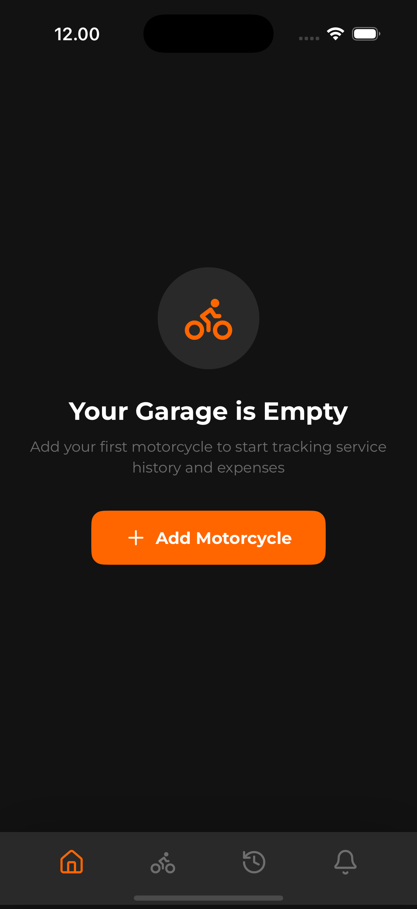
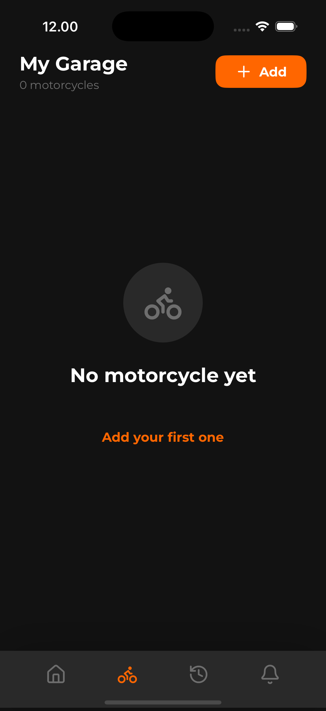
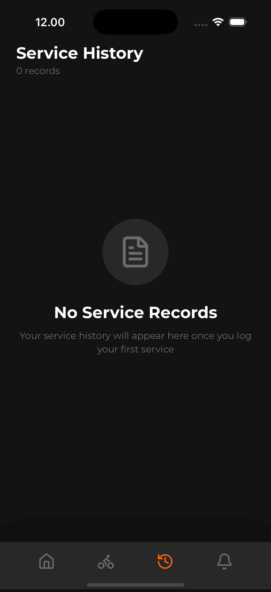
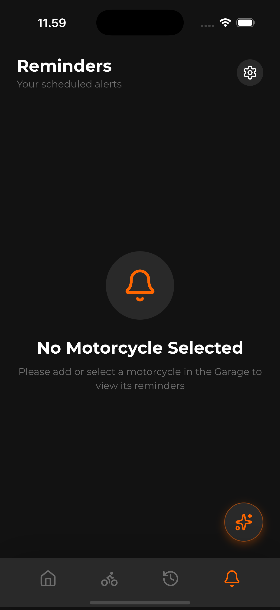
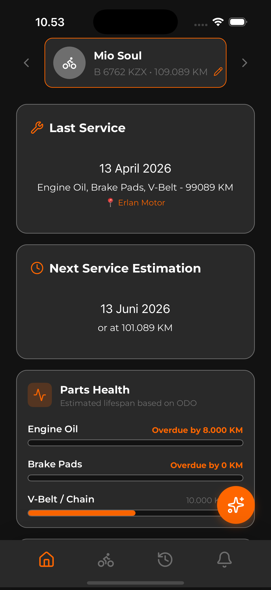
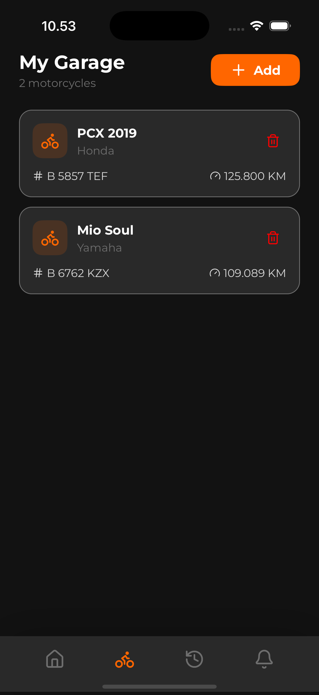
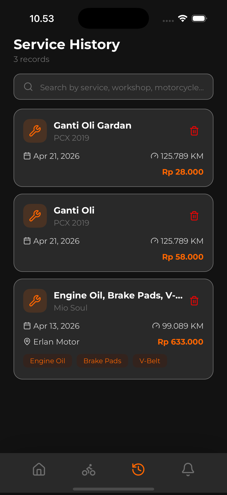
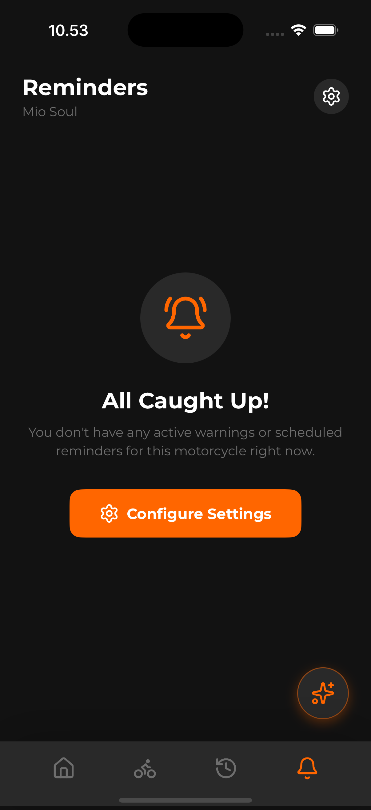
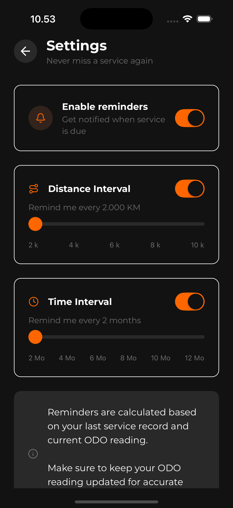
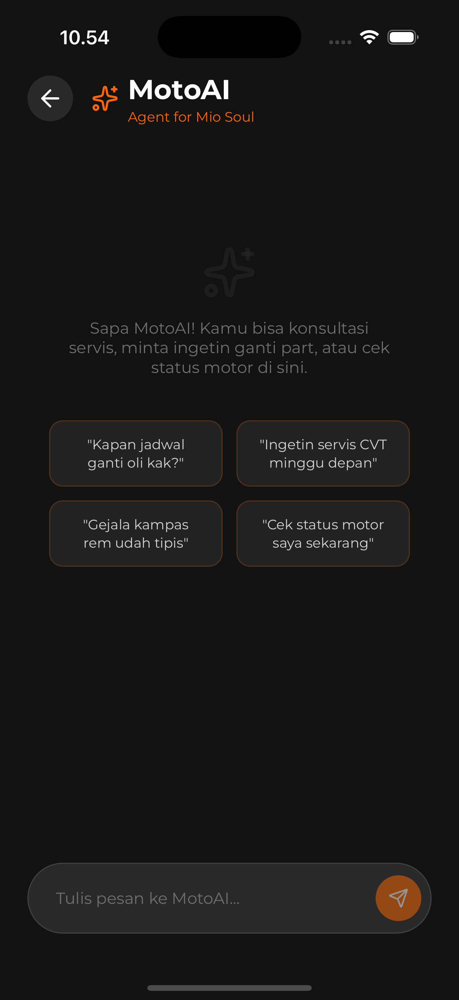

# 🏍️ MotoLog: Smart Motorcycle Maintenance Tracker

  

**MotoLog** is a local-first, blazing fast React Native application designed specifically for bikers to keep track of their motorcycle's service history, monitor parts lifespan, and manage expenses seamlessly. Built with a stunning dark-mode tailored aesthetic, MotoLog acts as your proactive virtual garage assistant.

---

## 📸 Screenshots

<p align="center">
  
  
  
  
  
</p>
<p align="center">
  
  
  
  
  
</p>

---

## ✨ Key Features

- **🤖 MotoAI (Agentic GenUI Assistant)**: An embedded AI assistant powered by Gemini. MotoAI has full contextual awareness of your garage and uses Tool Calling (Agentic AI) to generate rich, interactive UI cards directly within the chat. 
  - **Conversational Multi-Item Quick Logs**: Tell MotoAI "I just replaced the engine oil and brake pads for 200k", and it translates it into standard database categories, rendering a dynamic form to save it directly to Realm.
  - **Smart Proactive Warnings**: The AI automatically reads your odometer and service history to proactively warn you if a part is nearing its lifespan without you even asking.
  - **Conversational Odo Updates**: Tell MotoAI "My odo is now 15000", and it automatically updates the database.
- **Blazing Fast Offline-First Database**: Powered by Realm DB, MotoLog works 100% offline. No loading spinners, no waiting for server responses. Your data stays securely on your device.
- **Smart Parts Health Tracker**: Intelligent algorithm that parses your service history to calculate the lifespan of your Engine Oil, Brake Pads, and V-Belt/Chain based on your latest Odometer reading. Includes deep-linking "Action Buttons" for critical parts to instantly launch logging flows.
- **Multi-Garage Management**: Do you own more than one motorcycle? Easily switch between multiple profiles, each maintaining its own isolated service history and stats.
- **Expense Breakdown**: Visualizes your spending habits. Instantly know your total maintenance costs and your average monthly expense.
- **Native Push Notifications**: Never miss an oil change again! Set up time and distance-based local reminders powered by `@notifee`. The app will alert you safely even when closed.
- **Premium Aesthetics**: Crafted entirely with `twrnc` (Tailwind for React Native), it utilizes a cohesive, sleek dark-mode design with modern typography and interactive native Sliders.

---

## 🛠️ Technology Stack

- **Framework**: [React Native](https://reactnative.dev/) (v0.79.0)
- **AI / LLM**: [@google/genai](https://www.npmjs.com/package/@google/genai) (Gemini 2.5 Flash / 3.1 Flash-Lite)
- **Local Database**: [@realm/react](https://github.com/realm/realm-js)
- **State Management**: [Zustand](https://github.com/pmndrs/zustand) (with AsyncStorage Persistence)
- **Styling**: [twrnc](https://github.com/vadimdemedes/twrnc) (Tailwind CSS for React Native)
- **Navigation**: React Navigation V7 (Stack & Bottom Tabs)
- **Icons**: [Lucide React Native](https://lucide.dev/)
- **Native Notifications**: [@notifee/react-native](https://notifee.app/)

---

## 🚀 Getting Started

### Prerequisites
Make sure you have set up your React Native environment as per the [official documentation](https://reactnative.dev/docs/environment-setup).

### Installation

1. **Clone the repository** (if applicable) and navigate to the project directory:
   ```bash
   cd MotoLog
   ```

2. **Install JavaScript dependencies**:
   ```bash
   yarn install
   # or
   npm install
   ```

3. **Set up Environment Variables**:
   Create a `.env` file in the root directory and add your Google Gemini API Key:
   ```env
   GEMINI_API_KEY=your_api_key_here
   ```

4. **Install Native iOS Dependencies**:
   ```bash
   cd ios && pod install && cd ..
   ```

### Running the Application

**For iOS:**
```bash
yarn ios
```

**For Android:**
```bash
yarn android
```

---

## 📝 Roadmap (V2.0 Ideas)
- ⛽ **Fuel Tracker**: Monitor fuel consumption (KM/Liter).
- ☁️ **Data Backup & Restore**: Export encrypted JSON backups to easily migrate data between devices.
- 📊 **Advanced Analytics Screen**: Deep dive into spending categories through gorgeous interactive charts.

---
_Crafted with passion for riders, by riders._ 🏍️💨
